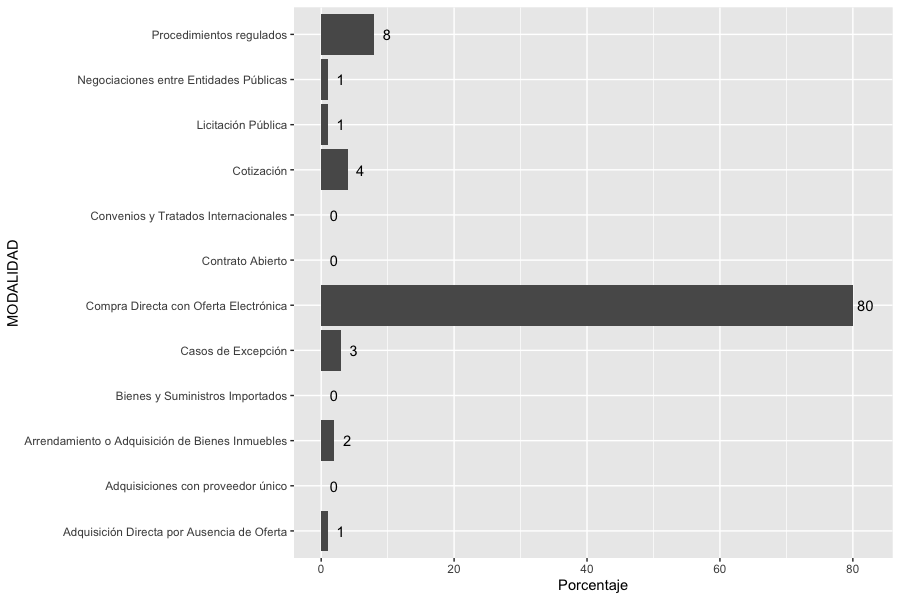
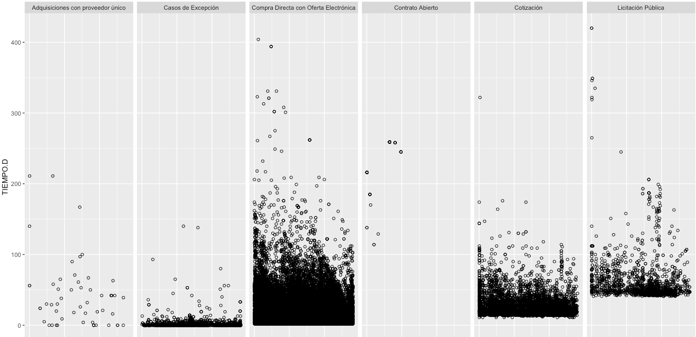
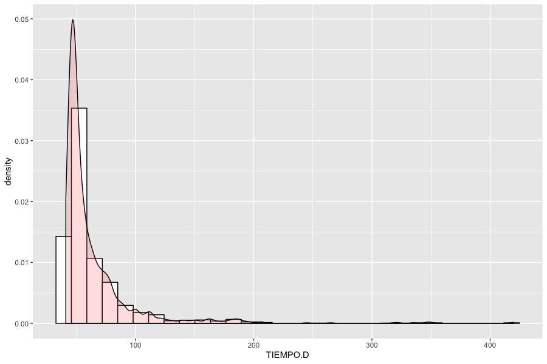
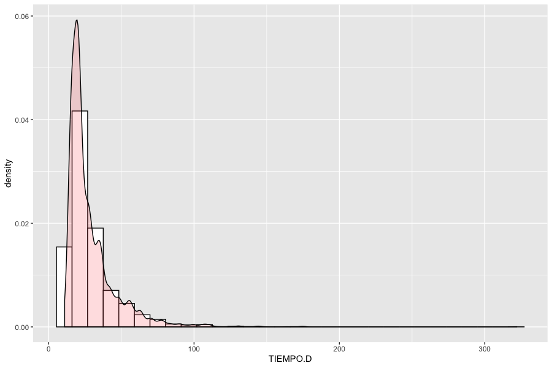
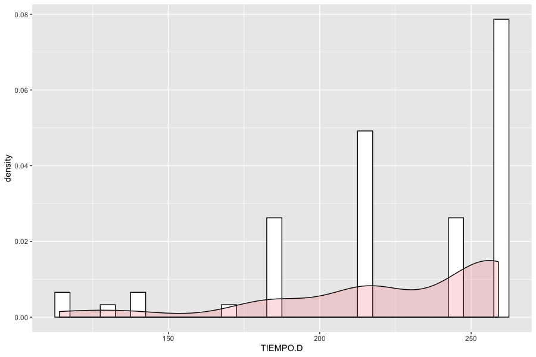
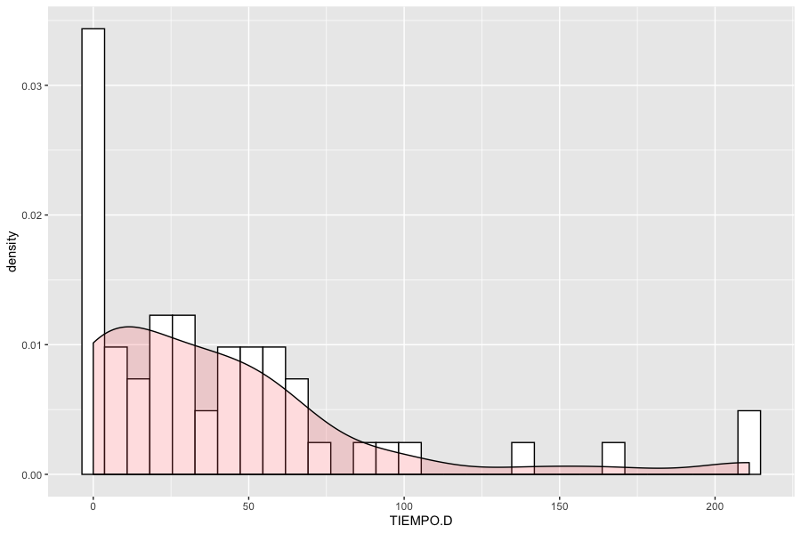
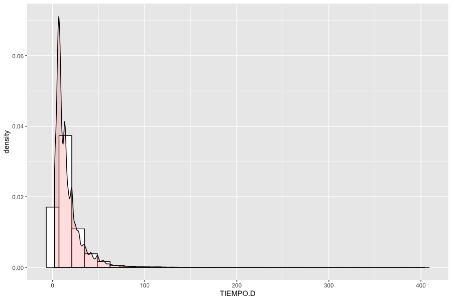
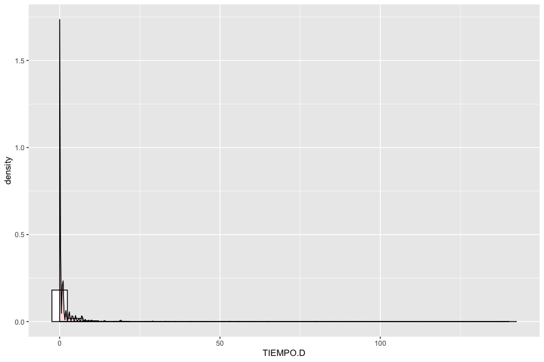
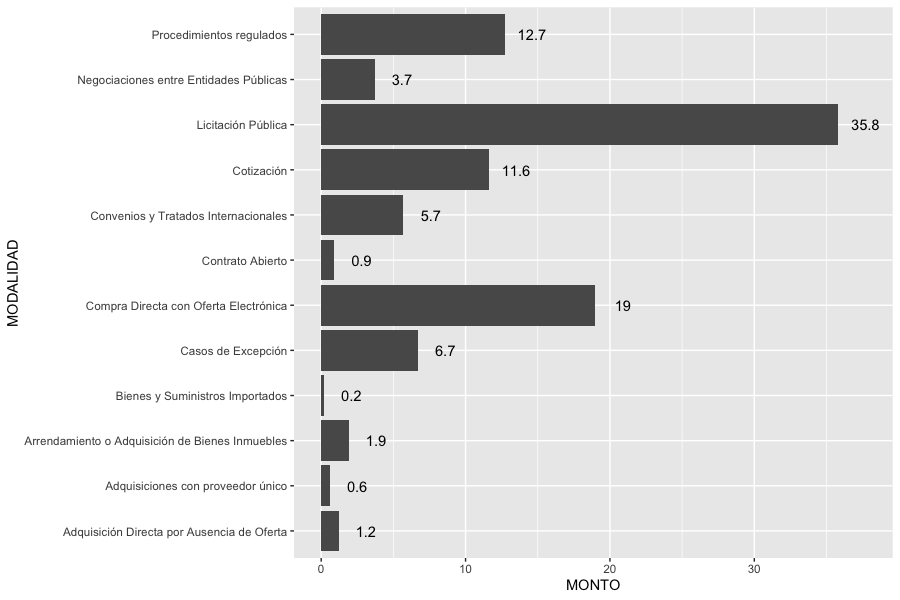

# Copia de Diseño final - Guía - El proceso de contrataciones públicas \(Guate\)

\[\[TOC\]\]

## Introducción

En varias ocasiones los estudios de contrataciones públicas asumen que el lector sabe cómo funciona el sistema en cada país. Generar herramientas para la socialización de las normativas en distintos contextos es útil para diferentes actores que requieren de un conocimiento previo para realizar una adecuada fiscalización. Del mismo modo, tener más claridad sobre los procesos de compras públicas en su contexto nacional puede reducir el costo e incentivar una mayor participación de competidores.

Teniendo esto en cuenta, el presente caso de estudio constituye un primer ejercicio para mostrar cómo puede aplicarse el ciclo de contrataciones públicas a la Ley de Contrataciones del Estado de Guatemala.

Para ello, se examina desde el marco del Estándar de Datos para las Contrataciones Abiertas las fases que se requieren para elaborar un proceso de contrataciones públicas. Con este fundamento, se pasa a entender los criterios aplicados en las distintas modalidades de la legislación guatemalteca. De tal forma, se despiertan inquietudes sobre los vacíos de información que existen en la presente legislación sobre "tiempos muertos", no regulados, que puedan incidir en los plazos, acotando o engrandeciendo la fase de la adjudicación.

En base al análisis normativo, el estudio verifica su aplicación en las contrataciones adjudicadas en el país en el año 2018. Tal y como se esperaba, los resultados muestran diferencias entre los plazos de la adjudicación en las diferentes modalidades de compra. También se pueden observar casos atípicos que tienden a alargar el proceso, lo que responde a los vacíos que existen en la regularización de los tiempos. Todo aquello, se centra en la siguiente pregunta: ¿qué tan largo resulta siendo el proceso de las adjudicaciones los contratos en Guatemala? La respuesta amerita una reflexión sobre qué acciones se necesitan para optimizar de los procesos sin sacrificar los mecanismos de transparencia. Dicho estudio tiene el objetivo es un primer punto de partida para futuras investigaciones en el país y el contexto internacional.

## Las cinco fases del proceso de las contrataciones públicas

Las contrataciones públicas son el conjunto de normas y procedimientos que comprenden desde el proceso de planificación hasta la implementación de un contrato. Dada la complejidad en su aplicación, las contrataciones públicas ha sido objeto de gran parte de la corrupción e ineficiencia de los gobiernos \(OCDE, 2016\).

Su mejoramiento se ha visto entorpecido por falta de claridad en los procesos y el alto grado de tecnicismo que requiere cada fase del proceso. Con el fin de contrarrestar y aportar al mejoramiento, en los último años, han surgido nuevas iniciativas como la creación del Estándar de Datos para las Contrataciones Abiertas \(OCDS, por sus siglas en inglés\), en 2015. Hoy por hoy, esta iniciativa tiene a más de 50 estados adheridos.

En esa línea, entre las lecciones aprendidas del Estándar de Datos para las Contrataciones Abiertas se destaca la importancia del acceso a la información y la necesidad de continuar con el proceso de mejorar la calidad de ésta, al igual que su difusión a distintos actores, fuera y dentro de la administración pública. Por ejemplo, se reconoce que el Estándar no sólo sirve para el proceso de fiscalización de la sociedad civil y actores interesados, sino también es una herramienta para mejorar la eficiencia en el sector público.

Para cumplir con ello, han sido necesarios los estudios casuísticos de varios países en las distintas regiones del mundo. Un hallazgos importante de los estudios ha sido la recurrencia de una problemática: integrar las etapas de contrataciones públicas.

Lo anterior propone la elaboración de un sistema integrado que logre documentar todas las fases del ciclo de las contrataciones públicas. Es así como el Estándar describe las fases de contrataciones públicas de la siguiente manera:

| FASE | DESCRIPCIÓN |
| :--- | :--- |
|  Planificación |  La entidades correspondientes deben realizar los planes de adquisiciones del Estado y las evaluaciones de las necesidades para anticipar el proceso de compras públicas. Existen esfuerzos de divulgación entre las partes. |
|  Licitación |  La fase se denomina como licitación pero no es exclusiva de alguna modalidad, sino se refiere al proceso para dar a conocer las ofertas y proporcionar las condiciones para que los oferentes puedan presentarse a los concursos. Esta fase debe contar con un periodo fijo. |
|  Adjudicación |  Se elige al oferente ganador del concurso, el cual pasa a ser "proveedor" del Estado. La entidad contratante o unidad responsable también notifica a los otros licitadores de la decisión. |
|  Contrato |  Una vez seleccionado el proveedor, se procede a la emisión del contrato. En ocasiones existe la oportunidad para la negociación sobre los bienes y servicios finales que se proporcionarán y el monto del contrato, en otras éstas se encuentran pactadas en la bases de licitación. |
|  Implementación |  Una vez se suscribe el contrato, comienza el proceso de implementación. Según el tamaño y el alcance del contrato, el proveedor debe cumplir las condiciones establecidas para recibir los pagos, que se encuentran dispersos a lo largo del período de implementación. Al final de la implementación, se debe realizar una evaluación del período de contratación. |

## Estado de la situación: Las contrataciones públicas y su apertura en Guatemala

En Guatemala no se ha implementado el Estándar de Datos para las Contrataciones Abiertas \(NOTE: Ficha de país, Open Contracting Partnership www.open-contracting.org/why-open-contracting/worldwide/\#/gt\), sin embargo en el 4to Plan de Acción Nacional de Gobierno Abierto \(2018\) se incorpora el Eje 12 sobre Transparencia Fiscal, Compras y Contrataciones Públicas \(NOTE: Compromisos del eje 12 del Eje de "Transparencia Fiscal, Compras y Contrataciones Públicas" www.gobiernoabierto.gob.gt/compromisos-del-eje-de-transparencia-fiscal-compras-y-contrataciones-publicas/ \). Como resultado, el gobierno de Guatemala establece varios compromisos \(22, 23 y 24\), dentro de los cuales se encuentra: “analizar para su adopción, una serie de instrumentos que conforman la estructura global del Estándar de Datos para las Contrataciones Abiertas” \(Alianza para el Gobierno Abierto Guatemala, 2018\). Además, el Ministerio de Finanzas Públicas se compromete a desarrollar una estrategia de comunicación para que la población conozca los estándares.

El actual Sistema de Información de Contrataciones y Adquisiciones del Estado, conocido como Guatecompras, es la entidad que compila ciertas fases de los procesos de adquisiciones y los pone a disposición del ciudadano, mediante una plataforma de acceso gratuito. Sin embargo, el sistema general de compras no se encuentra en una sola instancia o un único portal, sino que obliga al usuario a realizar distintas búsquedas, por ejemplo el sistema de información financiera se divide en: administración central \(SICOIN\); descentralizada y autónoma \(SICOIN.DES\); y gobiernos locales \(SICOIN.GL\). Todo lo anterior hace del proceso confuso y engorroso.

Sin embargo, el 4to Plan de Acción Nacional de Gobierno Abierto se compromete a realizar un Observatorio del Gasto Público que tiene como intención facilitar la búsqueda de información presupuestaria de las entidades centrales, descentralizadas y municipales, para facilitar las consultas de ejecución física y financiera.

Pese a esto, muchos esfuerzos se han realizado desde la Alianza de Gobierno Abierto, compuesta por entidades de gobierno y sociedad civil; la población no especializada no conoce, ni tampoco participa en la discusión. Es por ello que paralelamente a estas iniciativas es necesario crear información divulgativa sobre cómo funcionan las adquisiciones del Estado, de esa manera la o las propuesta pueden verse enriquecidas.

AÑADIR

## Caso de estudio: Una aplicación de la Ley de Contrataciones de Guatemala

### **1. Modalidades de contrataciones públicas**

Según la Ley de Contrataciones del Estado de Guatemala \(LCE\) existen cuatro tipos de modalidades: 1. Licitación; 2. Cotización; 3. Contrato abierto; y 4. Subasta electrónica inversa. Cada una de éstas tiene sus procedimientos y reglamentos pero son formalistas en el sentido que deben de acatar las obligaciones derivadas de un contrato. Esto quiere decir que las cuatro modalidades emplean de forma similar las fases identificadas en el ciclo de contrataciones públicas.

Sin embargo, la LCE contempla otros mecanismos para adquisiciones públicas que no requieren de procesos fijados y no se sujetan a todas las fases del ciclo de contrataciones públicas. De lo anterior aparece la categoría de modalidades específicas \(Artículo 43\) que se subdivide a seis tipos: 1. Compra de baja cuantía; 2. Compra directa con oferta electrónica; 3. Adquisiciones con proveedor único; 4. Arrendamiento de bienes muebles; 5. Arrendamiento de bienes inmuebles; 6. Dragado. Cada tipo presenta distintos criterios como: precio, cantidad, número de proveedores y servicios requeridos por el Estado.

No obstante, el principal criterio para distinguir entre cada modalidad es el monto del contrato público. A mayor precio más requerimientos se tienen en la fase previa a la adjudicación y más tiempo toma el proceso. Así, se puede distinguir las modalidades según el monto:

1. Licitación: precio mayor a Q900,000
2. Cotización: precio mayor a Q90,000 hasta Q900, 000
3. Contrato abierto: no se establece el monto
4. Subasta electrónica Inversa: no se establece el monto
5. Compra de baja cuantía: precio hasta 25,000
6. Compra directa con oferta electrónica: precio hasta 90,000
7. Adquisiciones de proveedor único: no se establece el monto
8. Arrendamiento de bienes muebles: no se establece el monto
9. Arrendamiento de bienes inmuebles:no se establece el monto
10. Dragado: no se establece el monto
11. Casos de excepción:no se establece el monto

Para la compra de baja cuantía la adquisición se realiza de manera directa cuando el precio es menor a Q25,000, sin embargo, la entidad determina los procedimientos. En el caso de la compra directa con oferta electrónica se puede prescindir de procesos de licitación o cotización cuando el monto sea mayor a Q25,000 y no supere de los Q90,000.

Otro mecanismo de adjudicación que presenta la LCE son los llamados Casos de Excepción \(Artículo 44\). Acorde a la normativa, la contratación no depende del monto y no es obligatorio el proceso de licitación o cotización. Los Casos de Excepción son objeto de confusión, ya que se suelen interpretar de forma exclusiva con el Estado de Excepción derivado de la Ley de Orden Público, pero así como lo indica su nombre, este proceso es aplicable para varios casos. Por ejemplo, las adjudicaciones que se realizan en el extranjero o las adquisiciones que hace el Tribunal Supremo Electoral durante el periodo electoral, entre otras.

###  **2. El ciclo de contrataciones públicas en Guatemala** 

#### 2.1  Fase de planificación

En el sistema de contrataciones públicas de Guatemala existe un proceso de planificación donde se elabora un Plan Operativo Anual \(POA\) durante el ejercicio fiscal, que sirve para crear el Plan Anual de Compras y Contrataciones \(PACC\). Todo ello permite a las entidades realizar consultas sobre saldos y fechas de abastecimiento.

Sin embargo, el PACC no se encuentra sistematizado y es flexible en su diseño. Se define así como una herramienta de planificación, por lo cual las entidades públicas no están obligadas a respetar el PACC y pueden realizar compras y contrataciones incluso cuando no se cuente con las asignaciones presupuestarias para cubrir los pagos \(Artículo 3\).

#### 2.2  Fase de licitación

Según los criterios mencionados, algunas modalidades específicas no requieren un proceso de convocatoria de los concursos, por lo tanto, no tienen una fase de licitación. Asimismo, los Casos de Excepción no están obligados a realizar procesos competitivos. En ese sentido, no existe un mecanismo para que proveedores y oferentes puedan acceder a dicho concursos. No obstante, en su mayoría los procesos de contrataciones públicas contemplan algún mecanismo de licitación.

A su vez, los plazos de los concursos varían según la modalidad \(Ver Cuadro 1\). Por ejemplo, la licitación es la modalidad con el plazo más prolongado, con 40 días hábiles como mínimo. Seguido de ello, las modalidades de cotización y subasta electrónica inversa contemplan un periodo de mínimo 8 días hábiles. El contrato abierto tiene una convocatoria que se lleva a cabo por medio de la Dirección Normativa de Contrataciones y Adquisiciones del Estado \(DNCAE\), pero el plazo no se encuentra regulado por la LCE y su reglamento.

Dentro de las modalidades específicas la adquisición con proveedor único estipula como máximo cinco días hábiles para realizar la convocatorio por medio de una oferta electrónica en Guatecompras. En el extremo opuesto, la modalidad más corta es la compra directa con oferta electrónica, que pese a su nombre, sí es un proceso competitivo con una convocatoria de mínimo 1 día hábil. Cabe destacar que el tiempo fijado en la fase de licitación responde a las bases del concurso.

Cuadro 1

### **Modalidades de compra y publicación de los concursos**

| Modalidad | Mecanismo de convocatoria | Tiempo: total de días para la publicación de concursos |
| :--- | :--- | :--- |
| Licitación | Oferta electrónica en el sistema de Guatecompras y Diario Oficial | Mínimo 40 días hábiles. Se añaden 8 días hábiles en caso de modificar las bases durante convocatoria. |
| Cotización | Oferta electrónica en el sistema de Guatecompras y Diario Oficial | Mínimo de ocho días hábiles. Se añaden 8 días hábiles en caso de modificar las bases durante convocatoria. |
| Contrato abierto | Dirección Normativa de Contrataciones y Adquisiciones del Estado \(DNCAE\), del Ministerio de Finanzas Públicas | El tiempo no se encuentra regulado. |
| Subasta electrónica inversa | Oferta electrónica en el sistema de Guatecompras y Diario Oficial | Mínimo ocho días hábiles antes del inicio de la puja inversa. |
| Compra directa por oferta electrónica | Oferta electrónica en el sistema de Guatecompras | Mínimo 1 día hábil Extensión de plazo 1 día hábil |
| Compra de baja cuantía | No existe convocatoria |  El tiempo no se encuentra regulado |
| Adquisición con proveedor único | Oferta electrónica en el sistema de Guatecompras y Diario Oficial | Máximo cinco días hábiles |
| Arrendamientos de bienes muebles | Oferta electrónica en el sistema de Guatecompras y Diario Oficial | El tiempo no se encuentra regulado. |
| Arrendamiento de bienes inmuebles | Oferta electrónica en el sistema de Guatecompras y Diario Oficial | El tiempo no se encuentra regulado. |
| Dragado | No existe convocatoria | El tiempo no se encuentra regulado |
| Casos de excepción | No existe convocatoria | El tiempo no se encuentra regulado |

#### 2.3 Fase de Adjudicación

Para determinar qué proveedor es el ganador del concurso, la Ley crea las juntas de cotización, licitación o calificación \(Artículo 40\). Según la normativa, son los únicos órganos competentes para recibir, calificar y adjudicar los contratos \(Artículo 10\). Es la autoridad competente \(Ver Cuadro 2\) la que nombra a los integrantes de la junta y debe aprobar o improbar las contrataciones públicas. Asimismo, el monto del concurso determina qué puesto debe desempeñar la autoridad competente.

Cuadro 2

### **Entidad compradora y autoridad competente**

| Entidades | Menor de Q900 mil Autoridad administrativa superior | Mayor de Q900 mil Autoridad superior |
| :--- | :--- | :--- |
| Organismo legislativo | Director general | Junta directiva |
| Organismo judicial | Gerente general | Corte Suprema de Justicia |
| Corte de Constitucionalidad y Tribunal Supremo Electoral | Presidente de la Corte de Constitucionalidad o al presidente del Tribunal Supremo Electoral | Pleno de la Corte de Constitucionalidad o del Tribunal Supremo Electoral |
| Organismo Ejecutivo | Funcionarios de forma permanente y por un plazo definido, designados por el Presidente y Vicepresidente de la República | Funcionarios de forma permanente y por un plazo definido, designados por el Presidente y Vicepresidente de la República |
| Ministerios y secretarías de la Presidencia de la República | Funcionarios de forma permanente y por un plazo definido, designados por el ministerio o secretarías. | El ministerio del ramo o secretarías. |
| Dependencias o entidades de la administración central | Funcionario designado por la autoridad jerárquicamente superior de la entidad, en forma permanente y por plazo indefinido. | El funcionario u órgano colegiado jerárquicamente superior responsable de la entidad. |
| Entidades estatales con personalidad jurídica, descentralizadas y autónomas | Gerente o funcionario equivalente. | Junta directiva, autoridad máxima. |
| Municipalidades y sus empresas | Alcalde municipal, gerente o funcionario equivalente de la empresa | Concejo municipal |
| Entidades o empresas, ONG, entidades sin fines de lucro, otras. | Gerente, director ejecutivo, representante legal o autoridad equivalente. | Órgano o autoridad superior de la entidad. |

Una vez se entienda lo anterior, el proceso se simplifica. Se puede observar que la fase de adjudicación para la licitación, cotización y contrato abierto es similar. En primer lugar, la Junta debe calificar las ofertas en un plazo de cinco días hábiles según los criterios \(primordialmente el costo\) de las bases. Después de seleccionar al oferente más conveniente se realiza una adjudicación parcial. En esta etapa se apertura el mecanismo de presentación inconformidades, las cuales se deben resolver en un plazo de diez días. Posterior, la Junta debe remitir el expediente a la autoridad superior, quien se encarga de aprobar o improbar lo actuado en un plazo de cinco días. Existe también un plazo regulado en el caso de que la autoridad superior no apruebe la decisión de la Junta.

A diferencia de lo anterior, en ocasiones las modalidades específicas no necesitan concurso —como por ejemplo el dragado— sin embargo, en su mayoría son procesos competitivos. La compra directa por oferta electrónica deben realizar una licitación o cotización si el monto supera los Q25 mil y existan más de dos proveedores. En el caso de que solo se presente un proveedor se puede realizar la adjudicación siempre y cuando cumpla con los requerimientos de las bases.

En los casos de excepción la adjudicación no obedece a ningún tiempo estipulado. El objetivo es garantizar procesos de contratación de la forma más rápida, que atiendan las necesidades urgentes.

## Modalidades de compra: Actores, competitividad en el proceso, plazos y mecanismos de inconformidades

### Modalidad: **Licitación**

| Actores | La junta de licitación está integrada por tres \(3\) miembros titulares y dos \(2\) suplentes, nombrados por la autoridad superior de la entidad contratante. | Se podrá solicitar asistencia de asesores de entidades del sector público. | La autoridad superior rectifica las inconformidades |
| :--- | :--- | :--- | :--- |
| Competitividad en el proceso | La junta de licitación adjudica la propuesta más conveniente para los intereses del Estado . En el caso de presentarse un solo oferente la junta de licitación puede realizar la adjudicación. |  |  |
| Total de días para la adjudicación | Se hace una calificación de las propuestas de los oferentes, dentro del plazo que señalen las bases. En casos en que las bases no hayan establecido plazo para la adjudicación, éste será de cinco \(5\) días hábiles, contados a partir del día señalado para la recepción y apertura de ofertas, prorrogables hasta un máximo de diez \(10\) días hábiles adicionales. |  |  |
| Proceso de inconformidades | Si existen personas inconformes por cualquier acto del los procedimientos, se debe de presentar sus inconformidades a través de Guatecompras, dentro de un plazo de cinco \(5\) días hábiles. la junta remitirá el expediente a la autoridad superior, dentro de los dos \(2\) días hábiles siguientes. La autoridad superior aprobará o improbará lo actuado por la Junta, con causa justificada, de conformidad con lo establecido en la ley, dentro de los cinco \(5\) días de recibido el expediente. Si la autoridad superior imprueba lo actuado por la Junta, deberá devolver el expediente para su revisión, dentro del plazo de dos \(2\) días hábiles posteriores de adoptada la decisión. La Junta, con base en las observaciones formuladas por la autoridad superior, podrá confirmar o modificar su decisión original, en forma razonada, dentro del plazo de cinco \(5\) días hábiles Dentro de los dos \(2\) días hábiles posteriores a la decisión, la Junta devolverá el expediente a la autoridad superior. La autoridad superior dentro de los cinco \(5\) días hábiles subsiguientes podrá aprobar, improbar o prescindir de la negociación. En caso de improbar, se notificará electrónicamente a través de GUATECOMPRAS, dentro de los dos \(2\) días hábiles siguientes, dando por concluido el evento. |  |  |

### Modalidad: **Cotización**

| Actores | La junta de cotización está integrada por tres \(3\) miembros titulares y dos \(2\) suplentes nombrados por la autoridad administrativa superior de la entidad contratante. | Se podrá solicitar asistencia de asesores de entidades del sector público. | La autoridad competente rectifica las inconformidades |
| :--- | :--- | :--- | :--- |
| Competitividad en el proceso | La junta de cotización adjudica la propuesta más conveniente para los intereses del Estado . En el caso de presentarse un solo oferente la junta de cotización puede realizar la adjudicación. |  |  |
| Total de días para la adjudicación | Se hace una calificación de las propuestas de los oferentes, dentro del plazo que señalen las bases. En casos en que las bases no hayan establecido plazo para la adjudicación, éste será de cinco \(5\) días hábiles, contados a partir del día señalado para la recepción y apertura de ofertas, prorrogables hasta un máximo de diez \(10\) días hábiles adicionales. |  | Para el proceso de inconformidades de la adjudicación se estipula un total de diez días hábiles. Por otra parte, el proceso de aprobación de la autoridad competente es de 26 días hábiles. |
| Proceso de inconformidades | Si existen personas inconformes por cualquier acto del los procedimientos, se debe de presentar sus inconformidades a través de Guatecompras, dentro de un plazo de cinco \(5\) días hábiles. la junta remitirá el expediente a la autoridad superior, dentro de los dos \(2\) días hábiles siguientes. La autoridad competente aprobará o improbará lo actuado por la Junta, con causa justificada, de conformidad con lo establecido en la ley, dentro de los cinco \(5\) días de recibido el expediente. Si la autoridad competente imprueba lo actuado por la Junta, deberá devolver el expediente para su revisión, dentro del plazo de dos \(2\) días hábiles posteriores de adoptada la decisión. La Junta, con base en las observaciones formuladas por la autoridad superior, podrá confirmar o modificar su decisión original, en forma razonada, dentro del plazo de cinco \(5\) días hábiles Dentro de los dos \(2\) días hábiles posteriores a la decisión, la Junta devolverá el expediente a la autoridad superior. La autoridad superior dentro de los cinco \(5\) días hábiles subsiguientes podrá aprobar, improbar o prescindir de la negociación. En caso de improbar, se notificará electrónicamente a través de GUATECOMPRAS, dentro de los dos \(2\) días hábiles siguientes, dando por concluido el evento. |  |  |

### Modalidad: **Contrato abierto** 

| Actores | La junta de calificación está integrada por representantes titulares y suplentes de la entidad o entidades y organismos que hayan solicitado o requerido el concurso. Cuando sea una única entidad la que gestione el mismo, la junta de calificación se está integrada por tres \(3\) representantes titulares y dos \(2\) suplentes, nombrados por la autoridad superior del organismo o entidad interesada. | Se cuenta con la asistencia de asesores de la Dirección Normativa de Contrataciones y Adquisiciones del Estado \(DNCAE\), del Ministerio de Finanzas Públicas. | Se podrá solicitar asistencia de asesores de entidades del sector público. | La autoridad administrativa superior rectifica las inconformidades |
| :--- | :--- | :--- | :--- | :--- |
| Competitividad en el proceso | La junta de calificación adjudica la propuesta más conveniente para los intereses del Estado . En el caso de presentarse un solo oferente la junta de calificación puede realizar la adjudicación, siempre y cuando cumpla con los requerimientos de las bases y el precio sea inferior a los precios de referencia que proporcione el Instituto Nacional de Estadística -INE. Si se da el caso que por cada marca hubiere más de tres oferentes con el mismo precio, la junta de calificación realizará un sorteo público para adjuntar a tres oferentes. |  |  |  |
| Total de días para la adjudicación | Se hace una calificación de las propuestas de los oferentes, dentro del plazo que señalen las bases. En casos en que las bases no hayan establecido plazo para la adjudicación, éste será de cinco \(5\) días hábiles, contados a partir del día señalado para la recepción y apertura de ofertas, prorrogables hasta un máximo de diez \(10\) días hábiles adicionales. |  |  |  |
| Proceso de inconformidades | La junta remitirá el expediente a la autoridad superior, dentro de los dos \(2\) días hábiles siguientes. La autoridad administrativa superior aprobará o improbará lo actuado por la Junta, con causa justificada, de conformidad con lo establecido en la ley, dentro de los cinco \(5\) días de recibido el expediente. Si la La autoridad administrativa superior imprueba lo actuado por la Junta, deberá devolver el expediente para su revisión, dentro del plazo de dos \(2\) días hábiles posteriores de adoptada la decisión. La Junta, con base en las observaciones formuladas por la autoridad superior, podrá confirmar o modificar su decisión original, en forma razonada, dentro del plazo de cinco \(5\) días hábiles Dentro de los dos \(2\) días hábiles posteriores a la decisión, la Junta devolverá el expediente a la autoridad superior. La autoridad superior dentro de los cinco \(5\) días hábiles subsiguientes podrá aprobar, improbar o prescindir de la negociación. En caso de improbar, se notificará electrónicamente a través de GUATECOMPRAS, dentro de los dos \(2\) días hábiles siguientes, dando por concluido el evento. |  |  |  |

### Modalidad: **Subasta electrónica inversa**  

| Actores |  La entidad contratante establecerá los requisitos y criterios de los postores. | Los postores deben estar habilitados. Se le asignará la denominación ficticia para participar en la etapa de puja inversa tales como "proveedor \(a\)", "proveedor \(b\)", etc. |
| :--- | :--- | :--- |
| Competitividad en el proceso | La autoridad administrativa superior de la entidad contratante será responsable de aprobar la adjudicación. |  |
| Total de días para la adjudicación | Tiempo no regulado. |  |

### Modalidad: **Compra de baja cuantía**

| Actores | Responsabilidad de quien autorice la adquisición pública. |  |
| :--- | :--- | :--- |
| Competitividad en el proceso | Se realiza procesos competitivos si el monto es mayor a Q25,000 | No es necesario realizar procesos competitivos cuando la suma es menor a Q25,000 |
| Total de días para la adjudicación | Tiempo no regulado |  |

### Modalidad: **Compra directa con oferta \*\***electrónica**\*\*** 

| Actores | Responsabilidad de quien autorice la adquisición |  |
| :--- | :--- | :--- |
| Competitividad en el proceso | Se realiza procesos competitivos cuando el monto sea mayor a Q25,000 y menor a Q90,000. | Cuando no se presenta ninguna oferta se tiene la posibilidad de contratar directamente |
| Total de días para la adjudicación | Tiempo no regulado |  |
| Proceso de inconformidades | La junta remitirá el expediente a la autoridad superior, dentro de los dos \(2\) días hábiles siguientes. La autoridad administrativa superior aprobará o improbará lo actuado por la Junta, con causa justificada, de conformidad con lo establecido en la ley, dentro de los cinco \(5\) días de recibido el expediente. Si la La autoridad administrativa superior imprueba lo actuado por la Junta, deberá devolver el expediente para su revisión, dentro del plazo de dos \(2\) días hábiles posteriores de adoptada la decisión. La Junta, con base en las observaciones formuladas por la autoridad superior, podrá confirmar o modificar su decisión original, en forma razonada, dentro del plazo de cinco \(5\) días hábiles Dentro de los dos \(2\) días hábiles posteriores a la decisión, la Junta devolverá el expediente a la autoridad superior. La autoridad superior dentro de los cinco \(5\) días hábiles subsiguientes podrá aprobar, improbar o prescindir de la negociación. En caso de improbar, se notificará electrónicamente a través de GUATECOMPRAS, dentro de los dos \(2\) días hábiles siguientes, dando por concluido el evento. |  |

### Modalidad: **Adquisición con proveedor único**

| Actores | La comisión receptora se encarga de verificar que exista un solo proveedor. |  | La autoridad superior de la entidad interesada rectifica el proceso. |
| :--- | :--- | :--- | :--- |
| Competitividad en el proceso | No se contempla un proceso competitivo, siempre y cuando, se verifica que existe un solo oferente. |  |  |
| Total de días para la adjudicación | Tiempo no regulado |  |  |
| Proceso de inconformidades | La junta remitirá el expediente a la autoridad superior, dentro de los dos \(2\) días hábiles siguientes. La autoridad superior aprobará o improbará lo actuado por la Junta, con causa justificada, de conformidad con lo establecido en la ley, dentro de los cinco \(5\) días de recibido el expediente. Si la La autoridad superior imprueba lo actuado por la Junta, deberá devolver el expediente para su revisión, dentro del plazo de dos \(2\) días hábiles posteriores de adoptada la decisión. La Junta, con base en las observaciones formuladas por la autoridad superior, podrá confirmar o modificar su decisión original, en forma razonada, dentro del plazo de cinco \(5\) días hábiles Dentro de los dos \(2\) días hábiles posteriores a la decisión, la Junta devolverá el expediente a la autoridad superior. La autoridad superior dentro de los cinco \(5\) días hábiles subsiguientes podrá aprobar, improbar o prescindir de la negociación. En caso de improbar, se notificará electrónicamente a través de GUATECOMPRAS, dentro de los dos \(2\) días hábiles siguientes, dando por concluido el evento. |  |  |

### Modalidad: **Arrendamiento con bienes muebles** 

| Actores | Responsabilidad de quien autorice la adquisición |  |
| :--- | :--- | :--- |
| Competitividad en el proceso | Sujeto a la modalidad de contratación que corresponda, según el monto a contratar. | Cuando no se presenta ningún oferente se tiene la posibilidad de contratar directamente |
| Total de días para la adjudicación | Tiempo no regulado |  |

### Modalidad: **Arrendamiento de bienes inmuebles**

| Actores | Responsabilidad de quien autorice la adquisición |  |
| :--- | :--- | :--- |
| Total de días para la adjudicación | Tiempo no regulado |  |

### Modalidad: **Dragado**

| Actores | Responsabilidad de quien autorice la adquisición |  |
| :--- | :--- | :--- |
| Total de días para la adjudicación |  Tiempo no regulado |  |

### Modalidad: **Casos de excepción**

| Tipo | Presidente de la República Consejo de Ministros Congreso de la República | MSPAS y IGSS | Entidades del Estado en el extranjero | Banco de Guatemala | Tribunal Supremo Electoral | Sujetos obligados |
| :--- | :--- | :--- | :--- | :--- | :--- | :--- |
| Competitividad en el proceso | Se pasa directamente a la adjudicación. Se permite la adquisición de bienes, suministros, obras y servicios para solucionar el Estado de Excepción, regulado por la Ley Orden Público. | Se pasa directamente a la adjudicación. Adquisición directa \(obligatoria\) de distintos medicamentos, que estén al amparo de convenios o tratados internacionales. | Se pasa directamente a la adjudicación. Las adjudicaciones que se realicen en el extranjero se hacen de manera directa. | Se pasa directamente a la adjudicación. Aplica en la acuñación de moneda metálica, compra de metales para acuñación de moneda, compra de sistemas, de equipo y la impresión de formas de billete de banco y de título valores. | Se pasa directamente a la adjudicación.Durante el periodo electoral se permite realizar de manera directa las adquisiciones públicas, vinculadas con el evento. | Se pasa directamente a la adjudicación. Contratar de manera directa los servicios básicos de energía eléctrica, de agua potable, extracción de basura y servicios de línea telefónica fija. |
| Total de días para la adjudicación | Tiempo no regulado | Tiempo no regulado | Tiempo no regulado | Tiempo no regulado | Tiempo no regulado | Tiempo no regulado |

Link: [https://docs.google.com/spreadsheets/d/1KzL66kW5cOgSVWhmpdVJE4PmiEVO5d3S9jXs5ao4ySE/edit\#gid=4743132](https://docs.google.com/spreadsheets/d/1KzL66kW5cOgSVWhmpdVJE4PmiEVO5d3S9jXs5ao4ySE/edit#gid=474313212)

### **Visualización del** sistema ****

Basado en el análisis normativo de las contrataciones públicas en Guatemala se utilizaron herramientas de visualización, basada en los sistemas de redes de la complejidad que intentan ofrecer una aproximación de cómo luce el sistema contrataciones públicas en sus distintas fases y procesos. Así, le permite al lector entender las partes pero también la relación que existe entre éstas.

Esto se hizo utilizando como referencia las líneas del metro.

## Análisis de datos: Contrataciones públicas en Guatemala 2018

Con base al análisis del ciclo de contrataciones públicas en Guatemala se examinaron los contratos adjudicados de enero 2018 al 31 de diciembre del 2018. Estos datos fueron obtenidos del portal de Datos Abiertos del Ministerio de Finanzas \(NOTE: [https://datos.minfin.gob.gt/pages/guia-de-datos-abiertos](https://datos.minfin.gob.gt/pages/guia-de-datos-abiertos)\) como una muestra de la reutilización de datos que han sido transparentados de manera activa y periódica. La muestra equivale a 140,988 contratos de las diferentes entidades del gobierno que ascienden a 21 mil millones de quetzales, equivalente al 28% del Presupuesto de la Nación para dicho año.

La **Gráfica 1** muestra el porcentaje de los contratos según las diferentes modalidades de compras en el 2018. Algunas modalidades aparecen con 0%, ya que el número de casos fue pequeño en comparación con otras modalidades. Sin embargo, se incluyen dentro de la muestra para estudiar a profundidad el tiempo que requiere realizar la compra mediante esta modalidad.

Se puede observar que la compra directa con oferta electrónica es la más utilizada con 112,151 contratos, equivalente al 80% del total de contrataciones adjudicadas en el periodo estudiado. Seguido de esto, se encuentran los procedimientos regulados que se aplican a las contrataciones públicas de las Organizaciones No Gubernamentales, entidades que reciban, administren o ejecuten fondos públicos y fideicomisos con fondos públicos \(Artículo 1\). La cotización equivale al 4% y la licitación que es el proceso más largo representa el 1% del total de compras públicas.

Gráfica 1

### **Porcentaje de contratos adjudicados en el 2018,**

### **por modalidad** 

_Fuente: Elaboración propia con datos del portal de Datos Abiertos del Ministerio de Finanzas 2018_

1. Tiempo para la adjudicación del contrato

En este apartado se calcula el tiempo en días de cada contrato a partir de la fecha de publicación hasta la fecha de adjudicación por cada modalidad. Es importante considerar que los procesos de cada fase de las contrataciones públicas de Guatemala se apegan a la descripción de las bases, por lo cual el tiempo puede variar, basado en las propias condiciones de la contratación. Tomando en cuenta esta consideración, el análisis espera encontrar diferencias notables entre modalidades según los tiempos regulados por la normativa.

En la **Gráfica \*\***2\*\* se puede notar la distribución de los datos en el tiempo entre cada modalidad. Existe una alta variación en la mayoría de las contrataciones públicas. Esto responde a la amplitud de bienes y servicios que engloba una modalidad de contratación. Lo interesante es la diferencia en los tiempos: en algunos casos se pueden percibir los datos aglutinados \(representando una tendencia general\), mientras que en otros se encuentran más distribuidos. Además, existen datos aislados que se salen de la media.

Gráfica 2

### **Días del proceso de adjudicación, por modalidad**

_Fuente: Elaboración propia con datos del portal de Datos Abiertos del Ministerio de Finanzas 2018_

#### 2. 1     Modalidades generales de contrataciones públicas

1. **LICITACIÓN**

Según el análisis previo, la modalidad de licitación es la que más tiempo requiere. La fase de convocatoria toma un mínimo de 40 días, mientras que la fase de adjudicación se estima para un plazo de 10 días cuando no se presentan inconformidades.

La **Gráfica 3** muestra la frecuencia de la variable tiempo, que se define en días, mostrando en el eje vertical un histograma de densidad que suma el total de todas las barras en 1. En este caso se puede observar que la distribución no es normal y el promedio de adjudicación fue de 63 días entre la fase de publicación y la de adjudicación. Contratos mayores de 100 días son los casos atípicos, como el proceso de adjudicación de 420 días para la compra de licencias de software para las fiscalías del Ministerio Público. Por el otro lado, existen nueve adjudicaciones que tardaron 41 días, lo que sugiere que la junta de licitación seleccionó al proveedor en un día hábil. Asimismo, el 94.6% de las contrataciones adjudicadas tomaron menos de 100 días para realizarse \(aproximadamente 3 meses\).

Gráfica 3

### **Tiempo estimado de los contratos adjudicados**

### **bajo la modalidad de** Licitación

_Fuente: Elaboración propia con datos del portal de Datos Abiertos del Ministerio de Finanzas 2018_

1. **COTIZACIÓN**

En el caso de la cotización se tiene contemplado un mínimo de 8 días hábiles para presentar ofertas, sin considerar el tiempo adicional que se otorga al no existir ningún oferente. En la Gráfica 4 se muestra un comportamiento similar a la Gráfica 3, con una distribución que no es normal y un promedio de contratos adjudicados en 28 días, en donde el 90% de los contratos se realizan en menos de 50 días. Nuevamente, existen casos atípicos, teniendo una adjudicación que se realizó en 322 días. Por el otro lado, el caso más rápido fue de 11 días, que significa que la Junta se tardó dos días para elegir al oferente. De la manera esperada, el proceso obedece la normativa y realiza adjudicaciones en un tiempo menor que la licitación.

Gráfica 4

### **Tiempo estimado de los contratos adjudicados**

### **bajo la modalidad de Cotización**

_Fuente: Elaboración propia con datos del portal de Datos Abiertos del Ministerio de Finanzas 2018_

1. **CONTRATO ABIERTO**

A diferencia de la licitación y cotización, la LEC no regula el plazo para la fase del concurso del Contrato abierto, la cual se encuentra bajo la dirección del DNCAE. Es una modalidad que atiende a las necesidades de dos o más entidades y requiere de una fase de preparación donde se crean las bases que establecen el plazo de cada contrato.

Así, los datos en la Gráfica 5 arrojan hallazgos importantes. En primer lugar la desviación de los datos es pronunciada y la distribución de datos se encuentra sesgada negativamente. Esto quiere decir que en el caso del contrato abierto los tiempos varían unos con otros, teniendo adjudicación de más de 250 días y otras menores de 150 días. Es así como el promedio de tiempo es de 224 días \(tres veces más que la licitación\). Es importante notar que no se está tomando en consideración el tiempo de la fase de preparación de las bases que bajo esta modalidad se hace de forma conjunta con las entidades requirentes y pasa a ser revisado por la DNCAE. De tal forma, se esperaría que el tiempo se incremente considerablemente una vez se estudie el proceso completo. Lo anterior quiere decir que a nivel comparativo el contrato abierto tiene un tiempo más prolongado, en promedio de 7 meses. No obstante, para el 2018 sólo hubo 61 contratos por Contrato Abierto de un total 140,988 contratos.

Gráfica 5

### **Tiempo estimado de los contratos adjudicados**

### **bajo la modalidad de Contrato Abierto**

Fuente: Elaboración propia con datos del portal de Datos Abiertos del Ministerio de Finanzas 2018

#### 2. 2    Modalidades específicas de contrataciones públicas

1. **ADQUISICIONES CON PROVEEDOR ÚNICO**

Las contrataciones con proveedor único no cuentan con un plazo determinado para las fases de concurso y adjudicación. Asimismo, según la LEC las entidades contratantes deben garantizar que no existe ningún otro proveedor para el bien o servicio solicitado. Esto explica porque en el 2018 sólo hubo 56 contratos bajo esta modalidad. En los datos de la Gráfica 6 se muestra una distribución sesgada de forma positiva, con un promedio de 40 días y un máximo de 211 días. A diferencia de las otras modalidades el 14% de las contrataciones se tardaron más de 100 días.

Gráfica 6

### **Tiempo estimado de los contratos adjudicados**

### **bajo la modalidad de Adquisición con proveedor único**

_Fuente: Elaboración propia con datos del portal de Datos Abiertos del Ministerio de Finanzas 2018_

1. **COMPRA DIRECTA CON OFERTA ELECTRÓNICA**

La compra directa con oferta electrónica es por mucho la modalidad más utilizada, comprende el 80% de todos los contratos adjudicados del 2018. Su objetivo es agilizar las contrataciones públicas, por lo cual no tiene que realizar un proceso competitivo si el monto es inferior a los Q,25,000. Al analizar los 112,151 contratos realizados bajo esta modalidad, la **Gráfica 7** presenta poca dispersión en los datos analizados. La mayoría de las adjudicaciones se realizan de forma veloz en un promedio de 16 días, siendo el mínimo de 2 días. Existe un caso atípico de 404 días, que modifica la dispersión de los datos. No obstante, la compra directa con oferta electrónica es la modalidad más rápido.

Gráfica 7

### **Tiempo estimado de los contratos adjudicados bajo la modalidad de Adquisición con compra directa con oferta electrónica**

Fuente: Elaboración propia con datos del portal de Datos Abiertos del Ministerio de Finanzas 2018

#### 2. 3  Casos de Excepción

Así como se indicó anteriormente, los casos de excepción no tienen un tiempo regulado. A diferencia de las modalidades específicas, no dependen del monto del contrato para definir el tipo de adjudicación. De tal forma, que en la Gráfica 8 los datos el promedio de duración de estas contrataciones en el 2018 fue de 1 día, teniendo 2,736 adjudicaciones con un mínimo 0 días. En el 2018 se dieron 3,865 adjudicaciones a través de esta modalidad \(6.7% del total\). Asimismo, el 97% de las contrataciones se hacen en menos de 10 días, siendo la adjudicación más tardada de 140 días. Es una modalidad en la que se realiza la adjudicación de forma inmediata al no pasar por el proceso de licitación y adjudicación.

Gráfica 8

### **Tiempo estimado de los contratos adjudicados**

### **bajo la modalidad de Adquisición con casos de excepción**

_Fuente: Elaboración propia con datos del portal de Datos Abiertos del Ministerio de Finanzas 2018_

#### 3. Monto y modalidades de contrataciones públicas

Otra variable pertinente para el análisis sobre las contrataciones públicas es el monto de dicha operación. Según los datos de la **Gráfica 9** se puede observar que la licitación tiene los montos más elevados, equivalente al 35.8% del total de la muestra. Al analizar el monto, componen el grupo más grande incluso cuando según los datos sólo representan el 1% de las adjudicaciones del 2018.

El monto de las adjudicaciones de la cotización tiene un promedio de Q437,648. Sin embargo, la compra más pequeña es de Q348, un monto que se encuentra por debajo de los Q90,000, que se define según la LCE como el mínimo para realizar una cotización. Este fue el caso en 36 adjudicaciones. A diferencia de esto, los datos muestran que en relación a la modalidad se respetó el techo de los Q900,000.

Por su parte, la segunda modalidad con el monto más elevado fue la Compra directa con oferta electrónica. Sin embargo, este dato es equivalente a la alta frecuencia de esta modalidad que representa el 80% de las adjudicaciones de la muestra. En ese sentido, es importante considerar que la compra directa con oferta electrónica se aplica cuando el precio de la compra oscila entre Q.25,000 y los Q.90,000. Al revisar los datos se encuentra un alto grado de variación, sin embargo se registran compras pequeñas menores de Q10.00, pero ninguna compra excede el parámetro de los Q90,000 fijados para esta modalidad.

Los datos para los Casos de Excepción muestran adjudicaciones de Q3.00 como mínimo, mientras que existe una adjudicación de Q. 172,769,110 que se utilizó para la construcción urbanización y vivienda La Dignidad para las familias afectadas por la tragedia del Volcán de Fuego. La alta disparidad entre los datos refleja el amplio número de actores e instituciones que pueden aplicar este proceso para sus propias particularidades. Por ejemplo, se reportan montos inferiores de los Q100.00 elaboradas por el TSE para la Consulta Popular con Belice.

Gráfica 9 **El \*\***Porcentaje del monto de los contratos adjudicados de cada modalidad en el 2018\*\*

**Fuente: Elaboración propia con datos \*\***del portal de Datos Abiertos del Ministerio de Finanzas 2018\*\*

## Conclusiones

El ciclo de contrataciones públicas es un herramienta que facilita el entendimiento de las fases y procedimientos de las contrataciones públicas. En el caso de Guatemala la fase de planificación no se encuentra integrada a los otros sistemas de información sobre las contrataciones. Esto es un desafío para analizar si las contrataciones obedecen a las metas y objetivos de las entidades contratantes. Pese a lo anterior, cada contrato contempla fases de licitación y adjudicación, establecidas en cada modalidad.

En Guatemala, las modalidades de las contrataciones públicas se distinguen según el monto del contrato. De tal forma que los concursos con montos elevados requieren un plazo más prolongado para la fase de convocatoria. Asimismo, la LCE estipula plazos mínimos pero otorga libertad a las entidades contratantes para especificar los plazos requeridos en las bases de la contratación.

En ese tenor, se regula el proceso de la adjudicación parcial en la que los integrantes de la Junta deben tomar la decisión para seleccionar al proveedor, pero no se estipula el tiempo para que la autoridad competente pueda realizar la adjudicación final. Por lo tanto, existen tramos vacíos en algunos procesos que pueden implicar que la fase de adjudicación se extienda en cada modalidad. También, las modalidades específicas no se atienen a los requisitos, y en ocasiones, pueden realizar una compra directa.

Sobre lo anterior, el presente estudio logra evidenciar que el tiempo estipulado para la adjudicación en las modalidades de licitación, cotización son procesos coherentes con la normativa. En el primero, se determinó que en promedio toman dos meses y en el último, las adjudicaciones se realizaron en menos de un mes.

A diferencia de estas modalidades, se determinó que en la modalidad de Contrato abierto el plazo promedio es de 224 días para adjudicar un contrato, equivalente a siete meses aproximadamente. Sin embargo, hubo pocos contratos con esta modalidad.

También es importante notar que la subasta electrónica inversa no aparece en la base de datos de las contrataciones del 2018, esto pone en evidencia que todavía es una modalidad incipiente en el proceso de contrataciones públicas de Guatemala.

Otras modalidades específicas como la Adquisición con proveedor único no se utilizan con frecuencia. Además, el tiempo que requiere para adjudicar el contrato se encuentra en medio de los plazos analizados para la licitación y la cotización, con 44 días en promedio. A diferencia, la compra directa con oferta electrónica es la más utilizada en Guatemala. Asimismo, dado que puede prescindir de la licitación y cotización \(en compras inferiores de los Q25,000\) se logra evidenciar que este proceso es más rápido con 16 días para la adjudicación de los contratos. En el otro extremo, se encuentran los casos de excepción que se hacen casi de forma inmediata.

La diferencia en los tiempos tiene relación con el rango de montos permitidos en cada modalidad. Esto se verifica al estudiar el promedio del monto total de las compras públicas. La licitación que es la modalidad que permite contratos públicos a partir de 900,000 es la más tardada. Además, existe una relación entre el monto y la frecuencia de la modalidad. Por ejemplo la compra directa con oferta electrónica comprende el 80% de las contrataciones, por lo cual presenta el segundo porcentaje del monto más grande.

De manera conclusiva, el análisis de la normativa arroja luz sobre los distintos tiempos de cada contrato. Asimismo, su estudio permite entender el grado de complejidad del sistema de contrataciones públicas. En esa línea, futuras investigaciones podrían elaborar metodologías comparativas entre los sistemas de contrataciones públicas, para así, detectar banderas rojas de malas prácticas que no sólo señalan la corrupción, sino puedan prevenirla.

## Referencias

Congreso de la República de Guatemala. \(1992\). Ley de Contrataciones del Estado \(Decreto57-92\). Guatemala: Diario de Centroamérica.

Comisión Presidencial de Gestión Pública Abierta y Transparencia. \(2018\). 4to Plan de Acción Nacional de Gobierno Abierto 2018-2020.Guatemala: Gobierno de la República de Guatemala.

Congreso de la República de Guatemala. \(2013\). Acuerdo Gubernativo Número 495-2014. Guatemala.

Gobierno Abierto Guatemala. \(2019\). Compromisos del Plan de acción en el eje Transparencia Fiscal, compras y contrataciones públicas. Recuperado de

[http://gobiernoabierto.gob.gt/compromisos-del-eje-de-transparencia-fiscal-compras-y-contrataciones-publicas/](http://gobiernoabierto.gob.gt/compromisos-del-eje-de-transparencia-fiscal-compras-y-contrataciones-publicas/)

OCDE. \(2016\). _Preventing Corruption in Public Procurement_.

Open Contracting Partnership. \(2018\). Annual Report. Recuperado de [https://www.open-contracting.org/wp-content/uploads/2019/03/OCP2018-AnnualReport.pdf](https://www.open-contracting.org/wp-content/uploads/2019/03/OCP2018-AnnualReport.pdf)

Open Contracting Partnership. \(2016\). Methodology for Open Contracting Scoping Studies. Recuperado de

[https://www.open-contracting.org/wp-content/uploads/2017/06/CIV-Scoping-Study-Final.pdf](https://www.open-contracting.org/wp-content/uploads/2017/06/CIV-Scoping-Study-Final.pdf)

## Sobre la autora

**Sofía Montenegro**

**FELLOW CONTRATACIONES ABIERTAS**

Sofía es una politóloga egresada de la Universidad Francisco Marroquín \(Guatemala\). Obtuvo un Máster en Opinión Pública y Comportamiento Político en la Universidad de Essex \(Inglaterra\).

Fue seleccionada entre decenas de candidatos para la Fellowship sobre Contrataciones Abiertas en Guatemala \(2018\) por su interés en la aplicación de metodologías de datos para la investigación de temas sociales, así como sus habilidades en lenguajes como R. Le interesa la academia en la manera en que es puesta en acción y abrir camino para nuevas generaciones de mujeres que participen sin restricciones en el mundo de los datos y la política. Como investigadora, le interesa el análisis de redes sociales, la corrupción como fenómeno, los procesos electorales y la aplicación de nuevas metodologías de análisis a partir de los datos. Actualmente se dedica a la docencia y es investigadora de la Asociación Civil Diálogos \(Guatemala\).

## Sobre la fellowship de Escuela de Datos

Las Fellowships son posiciones temporales para personas con experiencia e interés en la alfabetización de datos \(_data literacy_\). Durante este tiempo, las personas seleccionadas trabajan a la par de Escuela de Datos. Nuestros fellows son parte de una creciente red global que les brinda los beneficios del trabajo en red: compartir recursos y conocimiento, así como asesoría sobre cómo ser estratégicos en sus programas de formación.

Nuestro propósito es incrementar la conciencia sobre la importancia de las capacidades prácticas para trabajar con datos y formar comunidades que, en conjunto, pueden usar habilidades dateras para hacer los cambios que ellos quieren ver en su sociedad.

Nuestro programa de fellowships busca reclutar y entrenar a la siguiente generación de líderes en datos y entrenamiento para expandir el alcance de nuestro trabajo. Estas becas proporcionan formación y apoyo para periodistas, organizaciones de sociedad civil y personas que están cambiando su entorno usando datos de manera efectiva en su país.

Desde 2012, nuestros fellows han ayudado a múltiples organizaciones alrededor del mundo a construir sus capacidades para trabajar con datos, formar relaciones sólidas en redes y comunidades locales que continúan trabajando incluso después de que el período de la fellowship termina. Durante 2017 y 2018, trabajamos en Guatemala como parte del programa de Open Contracting de Hivos con Sebastian Oliva \(fellow 2017\) quien asesoró a los proyectos iniciales en programación y manejo del Estándar de Contrataciones Abiertas y Sofía Montenegro \(fellow 2018\), autora de esta investigación y del proyecto digital que la acompaña.

